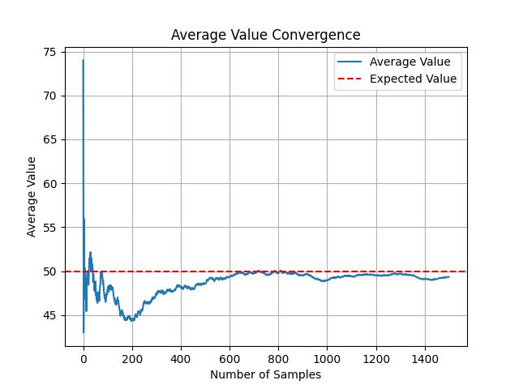

# 🎲 LargeNumbers

A repository designed to visualize the **law of large numbers**, which states:

> *"Given a sample of independent and identically distributed values, the sample mean converges to the true mean."* (Wikipedia)

## 📖 Table of Contents

- [🎲 LargeNumbers](#-largenumbers)
  - [📖 Table of Contents](#-table-of-contents)
  - [📋 Requirements](#-requirements)
  - [⚙️ Installation](#️-installation)
  - [🚀 Usage](#-usage)
    - [Parameters](#parameters)
    - [Example (script run)](#example-script-run)
    - [Example (plot)](#example-plot)
  - [✨ Features](#-features)
  - [🤝 Contributing](#-contributing)
  - [📜 License](#-license)

## 📋 Requirements

This project requires two Python libraries for numerical computations and plotting:

- **numpy**
- **matplotlib**

Install them using pip:

```sh
pip install numpy matplotlib
```

## ⚙️ Installation

Clone the repository and set up the script:

```sh
git clone https://github.com/OffworldAstronaut/LargeNumbers.git
cd LargeNumbers
chmod +x run.sh # Make the script executable
```

## 🚀 Usage

Run the script to generate a probability distribution, sample values, and plot the results:

```bash
./run.sh [parameters]
```

### Parameters

The number of parameters determines the type of distribution:

- **Uniform Distribution**: `<min> <max> <n_samples>`
- **Poisson Distribution**: `<min> <max> <lambda> <n_samples>`
- **Normal Distribution**: `<min> <max> <mu> <sigma> <n_samples>`

### Example (script run)

```bash
./run.sh 0 10 1000          # Uniform distribution
./run.sh 0 10 5 1000        # Poisson distribution
./run.sh 0 10 5 2 1000      # Normal distribution
```

### Example (plot)

Below is an example of a generated plot by the ``plotter.py``.\
The pictured distribution is an uniform probability distribution with $[a, b] = [0, 100]$.



## ✨ Features

- **Automated Execution**: Runs and plots results with simple command-line arguments;
- **OOP Design**: Easy to maintain, read, and extend.

## 🤝 Contributing

Contributions are welcome! Follow these steps:

1. Fork the repository.
2. Create a new branch: `git checkout -b feature-name`.
3. Commit your changes: `git commit -m 'Add feature'`.
4. Push to the branch: `git push origin feature-name`.
5. Open a pull request.

## 📜 License

This project is licensed under the [MIT License](LICENSE).